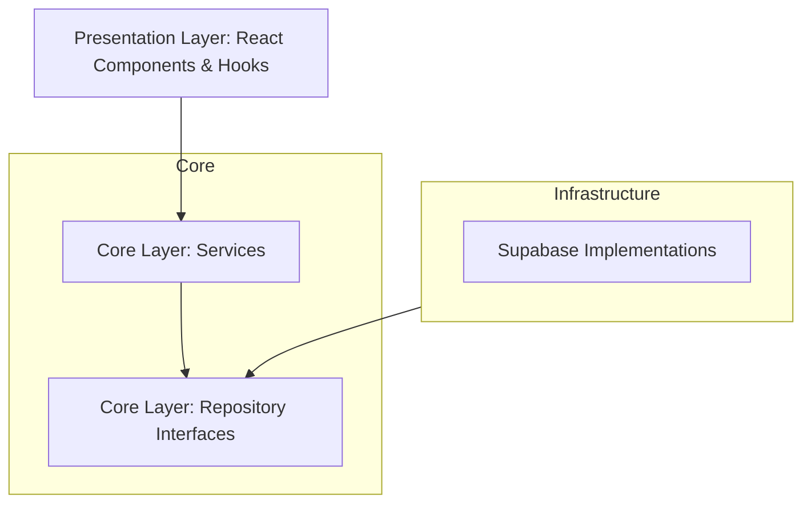

# PROJECT ROADMAP: TRAVELLER DASHBOARD

This document outlines the strategic plan for improving the Traveller Dashboard application, focusing on architectural integrity, code efficiency, and modern user experience.

## Phase 1: Architectural Foundation (Clean Architecture)
**Goal**: Decouple business logic from infrastructure and enforce strict layering using **Clean Architecture** principles.

- [ ] **Dependency Inversion**: Refactor `ServiceContainer` to remove hardcoded dependencies on Supabase.
- [ ] **Single Responsibility**: Extract data mappers from repositories to handle DTO to Entity conversions.
- [ ] **Interface Segregation**: Review and split large repository interfaces if necessary.
- [ ] **Strict Layering**: Ensure `src/core` has ZERO dependencies on `src/infrastructure`.

## Phase 2: Code Efficiency & Scalability (KISS, DRY, YAGNI)
**Goal**: Simplify implementation and improve maintainability.

- [ ] **Hook Refactoring**: Break down monolithic hooks (e.g., `useCharacterData`, `useCampaignData`) into smaller, composable hooks.
- [ ] **Utility Unification**: Merge redundant validation and permission logic spread across the codebase.
- [ ] **Remove Dead Code**: Audit the codebase for unused types, components, or functions (YAGNI).

## Phase 3: UX/UI Modernization
**Goal**: Create a premium, state-of-the-art interface.

- [ ] **Design System**: Implement a cohesive design system using CSS variables for colors (HSL), spacing, and typography.
- [ ] **Micro-animations**: Add subtle transitions for state changes, hover effects, and page transitions.
- [ ] **Dark Mode Polish**: Enhance the dark mode experience with better contrast and vibrant accents.
- [ ] **Responsive Refinement**: Optimize layouts for various screen sizes with a mobile-first approach.

## Phase 4: Legal & Licensing
**Goal**: Establish a clear Open Source identity.

- [ ] **FSF License Adoption**: Adopt the **GNU General Public License v3.0 (GPL-3.0)** to ensure user freedom and reflect the project's community-driven nature.
- [ ] **License Documentation**: Create a `LICENSE` file and add license headers to source files.

---

## Appendix A: Software Principles

### SOLID Principles
- **S**ingle Responsibility: A class should have one, and only one, reason to change.
- **O**pen/Closed: Software entities should be open for extension, but closed for modification.
- **L**iskov Substitution: Objects in a program should be replaceable with instances of their subtypes without altering the correctness of that program.
- **I**nterface Segregation: Many client-specific interfaces are better than one general-purpose interface.
- **D**ependency Inversion: Depend upon abstractions, not concretes.

### KISS (Keep It Simple, Stupid)
Avoid unnecessary complexity. Simple code is easier to read, test, and maintain.

### YAGNI (You Aren't Gonna Need It)
Don't implement features or abstractions until they are actually needed.

### DRY (Don't Repeat Yourself)
Every piece of knowledge should have a single, unambiguous representation within a system.

## Appendix B: Target Architecture (Clean Architecture)

The project follows **Clean Architecture** (by Robert C. Martin). This ensures the business logic (Core) remains independent of UI, Databases, and External Agencies.

**Key Architectural Rule**: Dependencies only point inwards. The Core layer (Entities and Use Cases/Services) must not know about the Infrastructure layer (Supabase, Fetch, etc.). This makes the system:
1. **Independent of Frameworks**
2. **Testable**
3. **Independent of UI**
4. **Independent of Database**
